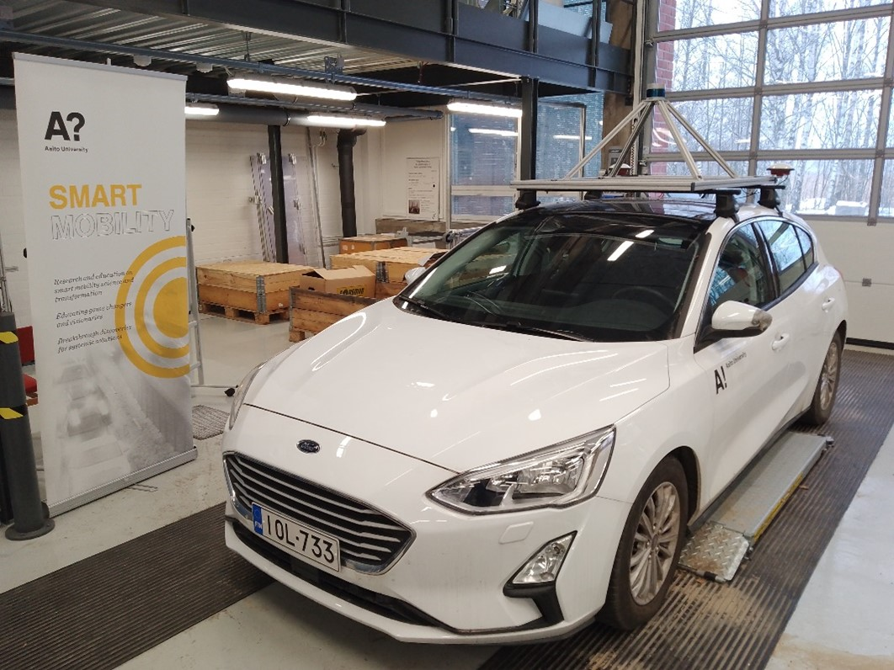

#################################
Welcome to Henry's documentation!
#################################

**Henry** is a research platform vehicle at the Autonomy and Mobility laboratory at Aalto University.

Contents
========

.. toctree::

  system
  cameras
  lidar
  gnss
  platform_usage

See :doc:`platform_usage` for how to start everything up and make modifications to the launch configurations.

The individual pages for each sensor have more detailed information on what certain parameters do and how the sensors are set up.

The system page has diagrams of the connections and power setup.

Vehicle
=======

- Ford Focus (IV) 2019
  - 1.5L Diesel, 88 kW

Sensor setup
============

For a detailed diagram of the setup with connections, see :doc:`system diagram <system>`.

* :doc:`Camera <cameras>`

  * Blackfly S BFS-U3-50S5C
  * Resolution: 2448 x 2048

* Can-bus connections to 4 different can networks 

  * Possibility to be connected into 2 different can busses simultaneously 
  * Peak can-to-ethernet interface 

* :doc:`Lidar <lidar>`

  * Velodyne Ultra Puck 80-VLP-32C-B 
  * Channels: 32 
  * Range: 200m 
  * Field of View
  
    * horizontal: 360°, vertical: 40° (-25° to +15 °) 

  * 3D LiDAR Data Points Generated: 
    
    * Single Return Mode:    ~600,000 points per second  
    * Dual Return Mode:     ~1,200,000 points per second 

* :doc:`GNSS and IMU<gnss>`

  * PwrPak7D E2, with dual antenna installation (Tallysman VSP6337L) 
  * DGPS corrected (RTK capable device) 
  * Integrated inertial measure unit

Software
========

* Ubuntu 22.04
* ROS2 Humble

Coordinate frames
=================

TODO: Coordinate frames (TF)