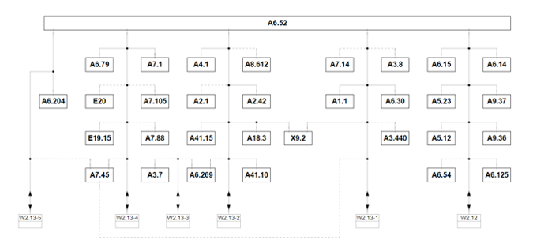

System diagrams
==============

Different sensors and actuators connected to Henry are shown in the diagram below.

System
----------

.. image:: images/Henry_physical_connection_diagram_with_IPs.png
   :width: 1000
   :alt: System diagram of Henry

Power diagram
-------------

.. image:: images/Henry_power_diagram.png
   :width: 1000
   :alt: Power diagram of Henry

Signal diagram
-------------

.. image:: images/Henry_signal_diagram.png
   :width: 1000
   :alt: Signal diagram of Henry

CAN bus
-------
The platform has access to 3 different high speed CAN networks. All the networks are presented below.

List of available control units in each network. 

1. **HS 1 CAN (C-1) (W2.13-1)**
   
   *A1.1 Engine Control Unit
   *A3.440 Differential Control Unit (optional)
   *A3.8 Automatic Transmission Control Unit (optional)
   *A6.30 Central Electronics Control Unit
   *A7.14 Parking Aid Control Unit (optional)
   *A7.45 Media Interface Control Unit
   *X9.2 OBD Socket
 
2. **HS 2 CAN (C-2) (W2.13-2)**
   A2.1 ABS Control Unit
   A2.42 Vehicle Dynamics Control Unit
   A4.1 Airbag Control Unit
   A6.269 Image Processing Unit (optional)
   A8.612 Headlamp Control Unit (optional)
   A18.3 Selector Lever Control Unit 
   A41.10 Steering Booster Control Unit
   A41.15 Steering Column Electronics Control Unit
   X9.2 OBD Socket 
3. **HS 3 CAN (C-3) (W2.13-3)**
   A3.7 Cruise Control Unit (optional)
   A6.269 Image Processing Unit (optional)

CAN bus connection to the vehicle is done via the gateway unit (at the same time gateway is providing the OBD socket) which is located under the steering wheel, behind OBD connector.

.. image:: images/henry_gateway.png
   :width: 1000
   :alt: CAN bus diagram of Henry

