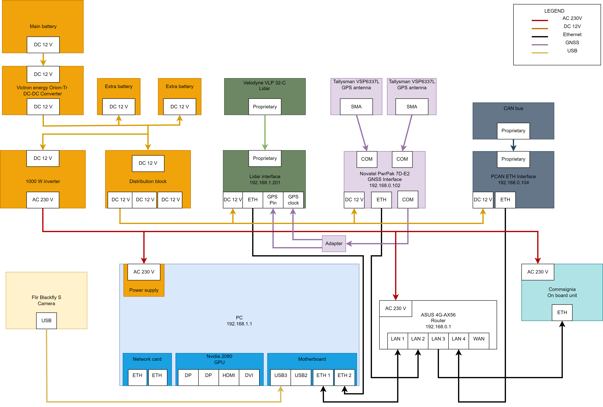
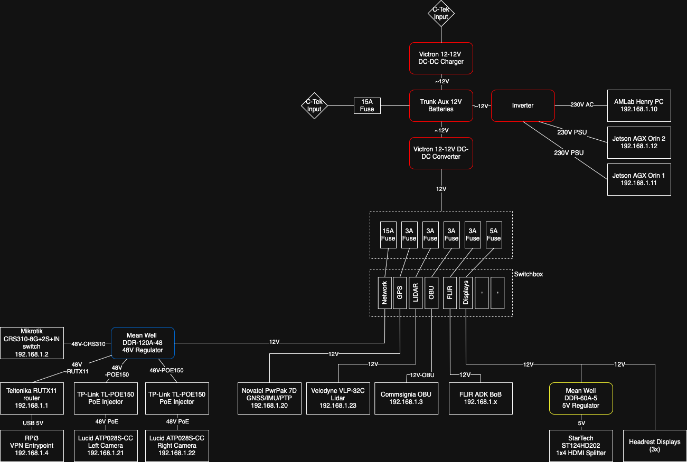
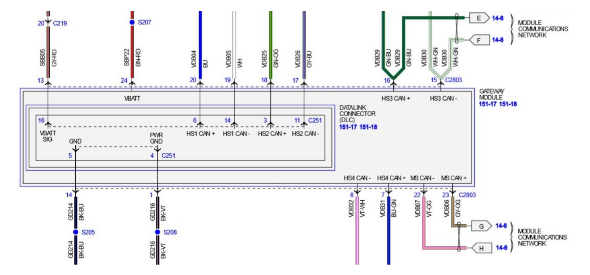

System diagrams
==============

Different sensors and actuators connected to Henry are shown in the diagram below.

System
----------

Power diagram
-------------

Signal diagram
-------------

.. image:: images/Henry_signal_diagram.png
   :width: 1000
   :alt: Signal diagram of Henry

CAN bus
-------

